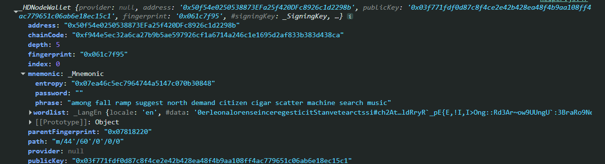
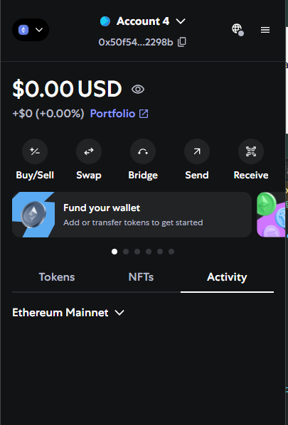

# 📘 Blockchain Wallet & Smart Contract Basics

---

### 1. What are some alternative wallet options available for managing blockchain assets besides MetaMask?

**Answer:**

- Trust Wallet  
- Coinbase Wallet  
- Ledger (hardware wallet)  
- Phantom (for Solana)  
- Rainbow Wallet

---

### 2. Is it possible to store metadata directly within a blockchain block?

**Answer:**

Yes, but it’s **limited and costly**:

1. You can store small metadata using:
   - The transaction `data` field  
   - Smart contract storage  

2. But storing data on-chain is expensive and limited.  
   

---

### 3. How can smart contracts be accessed or interacted with using a blockchain wallet?

**Answer:**

1. Connect your wallet (like MetaMask) to the app.  
2. Use tools like `ethers.js` or `web3.js` to call smart contract methods.  
3. Your wallet signs and sends the transaction to the blockchain.  
4. The contract processes the call and returns a result or changes state.

---

### 4. How can blockchain wallets or smart contracts be integrated with APIs for seamless application connectivity?

**Answer:**

1. Use JavaScript libraries like `ethers.js` or `web3.js`.  
2. Connect to a blockchain node using an RPC provider (e.g., Infura, Alchemy).  
3. Use these libraries to:
   - Read data from the blockchain  
   - Send transactions  
   - Interact with smart contracts  
4. Combine these with your backend/frontend APIs for smooth integration.

---

### 5. What is the process for creating and managing multiple wallets programmatically or within a wallet application?

**Answer:**

1. Use a library like `ethers.js` to create wallets:
   ```js
   const wallet = ethers.Wallet.createRandom();


# 📘 Understanding Smart Contract Calls, Blockchain Nodes, and the EVM

---

### ✅ **1. Read-only Calls** (`view` or `pure` functions)

- ⚡ These **do not trigger MetaMask**.
- 💸 No gas fee is required.
- 📡 No blockchain transaction takes place.
- 📥 The data is read directly from the blockchain node.
- 🧪 **Example:** `getHash()` — returns stored hash without changing any data.

---

### ✏️ **2. State-Changing Calls** (functions that **write** to the blockchain)

- 🔐 These **require MetaMask to sign the transaction**.
- ⛽ Gas fees are required.
- 🧾 A new transaction is created and sent to the blockchain.
- ✅ MetaMask will **prompt the user** to confirm the action.
- 📌 You must be using an **injected provider** like MetaMask (or another signer).

---

## 🧠 What is a Blockchain Node?

A **blockchain node** is a computer or software that participates in a blockchain network by:

- ✅ Validating new transactions and blocks  
- ✅ Storing a copy (partial or full) of the blockchain ledger  
- ✅ Communicating with other nodes to keep the network in sync  

---

## ⚙️ What is the EVM (Ethereum Virtual Machine)?

- The **Ethereum Virtual Machine (EVM)** is the **runtime environment** for executing smart contracts on the Ethereum blockchain.
- It acts as a **virtual computer** that runs the compiled bytecode of contracts on every participating node.
- This ensures secure and consistent execution across the decentralized network.

---

### 🔍 Summary Table

| Aspect               | Explanation                                                                 |
|----------------------|------------------------------------------------------------------------------|
| Decentralized Network | Nodes communicate & verify transactions together, no central authority      |
| Decentralized Database | Shared ledger stored on many nodes, tamper-proof and transparent           |

---


# Blockchain Ledger Output (Ganache Rpc Server)

---

🔢 **Block #0** | ⛓️ Hash: `0x7915777cdb7cd6064d23c53076232844e3ffb41b5bf30903b516374b7cb71686`  
📅 Timestamp: 7/21/2025, 5:34:40 PM  
📄 Transactions (0):

━━━━━━━━━━━━━━━━━━━━━━━━━━━━━━━━━━━━━━━

🔢 **Block #1** | ⛓️ Hash: `0xeaf28d682bfd44dadd981843071061b9065ea9e67e0d1588a350cb2dbe774b69`  
📅 Timestamp: 7/21/2025, 5:35:44 PM  
📄 Transactions (1):

- 🧾 Tx Hash: `0xcf8d952db4fea75681cd172d984989ff040582c239a871ee24c2007c11e28c36`  
  - 📤 From: `0x4D321bEE1df75cc18aC9835ccFE42d97028A530C`  
  - 📥 To: `0xE4b7D89138318A54e510691Bf527ad85Bd0A151e`  
  - 💰 Value: 0.01 ETH  
  - 🧬 Data: `0x`  
  - ⛽ Gas Limit: 21000

━━━━━━━━━━━━━━━━━━━━━━━━━━━━━━━━━━━━━━━

🔢 **Block #2** | ⛓️ Hash: `0x08983048d8ef6f4a4028f53ee9b689f2df352bf0c3dfcd14ce78101a27b5276d`  
📅 Timestamp: 7/21/2025, 5:35:45 PM  
📄 Transactions (1):

- 🧾 Tx Hash: `0xcface45ffe5196baca7396b17fc75961c7e7530080b7c51bd56aa825400ace05`  
  - 📤 From: `0x4D321bEE1df75cc18aC9835ccFE42d97028A530C`  
  - 📥 To: `0xE4b7D89138318A54e510691Bf527ad85Bd0A151e`  
  - 💰 Value: 0.01 ETH  
  - 🧬 Data: `0x`  
  - ⛽ Gas Limit: 21000

━━━━━━━━━━━━━━━━━━━━━━━━━━━━━━━━━━━━━━━

🔢 **Block #3** | ⛓️ Hash: `0x6fa58fc98591a859fbe79854bafe0429f9b6ff20917181a3e8ff65e25c900a02`  
📅 Timestamp: 7/21/2025, 5:35:45 PM  
📄 Transactions (1):

- 🧾 Tx Hash: `0xb6dec5b7296867f40dae0a71c87e0752b3b3f49bbec148e045db5c812ac48b26`  
  - 📤 From: `0x4D321bEE1df75cc18aC9835ccFE42d97028A530C`  
  - 📥 To: `0xE4b7D89138318A54e510691Bf527ad85Bd0A151e`  
  - 💰 Value: 0.01 ETH  
  - 🧬 Data: `0x`  
  - ⛽ Gas Limit: 21000

# Ethereum Wallet: Creation and Import



